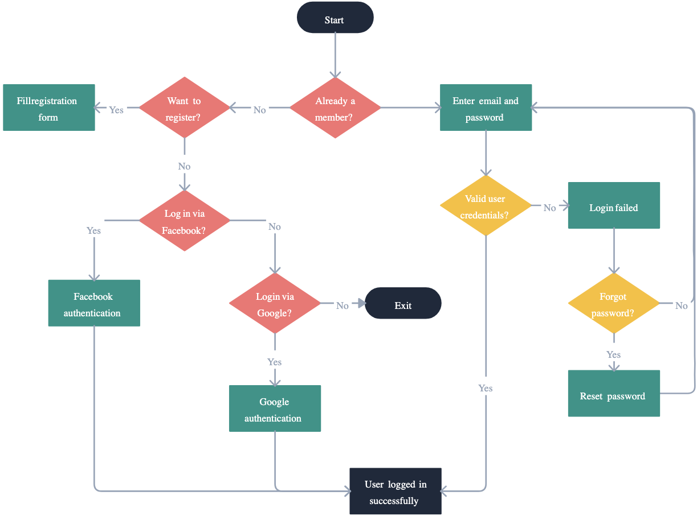
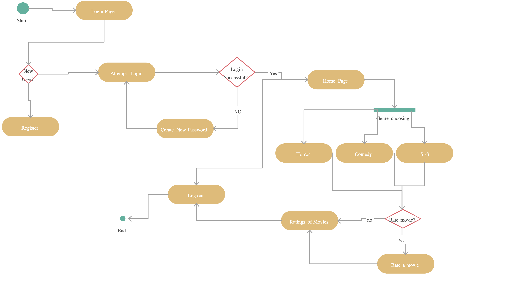

# 1. PROJECT DESCRIPTION
ozuFlix is a web-based platform that provides users with access to an extensive library of films and series in a range of genres. Creating an easily navigable and accessible environment for users to explore, discover, and enjoy their favorite movies and series is the main objective of ozuFlix. Personalized watchlists, user authentication, and social media integration are just a few of the features that ozuFlix offers to make watching content on all devices seamless.

# 2. USAGE SCENARIOS

## SCENARIO 1:
### Landing on ozuFlix:
 -A user lands on the homepage where featured movies are displayed prominently.

### Using Filters: 
 -User uses the genre dropdown to filter movies by "whatever user wants".

### Selecting a Movie:
 -From the filtered list, User clicks on the "any movie" movie card to learn more.

### Watching the Movie:
 -Intrigued, User clicks on the "Play" button and begins watching the movie.

 
## SCENARIO 2:
### Visiting the Sign-Up Page:
 -A new visitor clicks on the "Sign In" button and is directed to the sign-up form.

### Entering Details: 
-Visitor fills in his/her details, including username, email, and password.

### Completing Sign-Up: 
-After clicking the "Sign up" button, visitor successfully creates his/her ozuFlix account.

## SCENARIO 3:
### Navigating to Series:
-A user selects the "Series" tab from the navigation bar to view available TV series.

### Filtering Series:
-User decides to filter the series by "Sci-Fi" to find something interesting to watch.

### Choosing a Series to Watch: 
-User picks "Stranger Things" from the list and starts watching the first episode.

# 3. PAGE FLOW DIAGRAM

# 4.RESPONSIBILITIES OF EACH PROJECT MEMBER

# 5.INSTRUCTIONS FOR RUNNING PROJECT

git clone https://github.com/OzgurTY/cs391-project1.git

